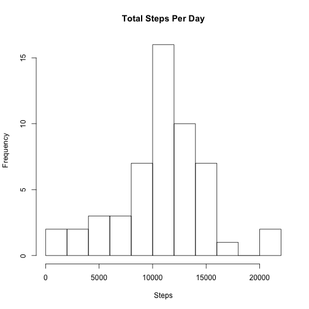
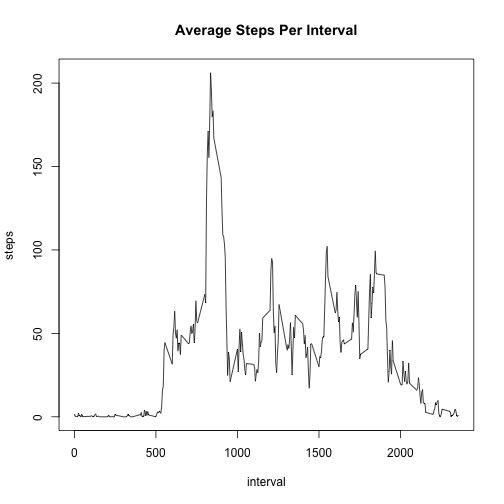
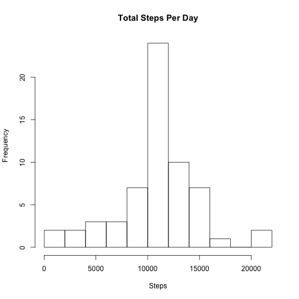
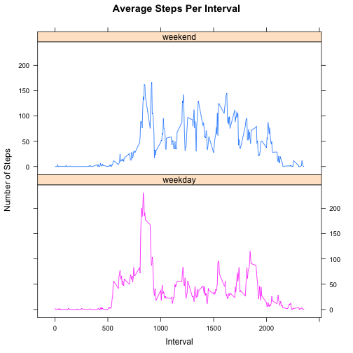

## Loading and preprocessing the data

```r
library (lattice)
library(lubridate)
data <- read.csv("./RepData_PeerAssessment1/activity.csv")
```


## What is mean total number of steps taken per day?
*1.Make a histogram of the total number of steps taken each day*

```r
data_naomit <- data[complete.cases(data),]
stepTotalByDay <- aggregate(steps ~ date, data_naomit, sum)
hist(stepTotalByDay$steps, breaks = 10, main = "Total Steps Per Day", xlab = "Steps")
```

 


*2. Calculate and report the mean and median total number of steps taken per day*

```r
mean(stepTotalByDay$steps)
```

```
## [1] 10766.19
```

```r
median(stepTotalByDay$steps)
```

```
## [1] 10765
```
The mean total number of steps taken per day is 1.0766189 &times; 10<sup>4</sup>
The median total number of steps taken per day is 10765

## What is the average daily activity pattern?
*1.Make a time series plot (i.e. type = "l") of the 5-minute interval (x-axis)* 
*and the average number of steps taken, averaged across all days (y-axis)*

```r
averageDailyPattern <- aggregate(steps ~ interval, data_naomit, mean)
with(averageDailyPattern, plot(interval, steps, type = 'l', main = "Average Steps Per Interval"))
```

 


*2.Which 5-minute interval, on average across all the days in the dataset, contains the maximum number of steps?*

```r
maximumSteps <- averageDailyPattern[averageDailyPattern$steps == max(averageDailyPattern$steps), ]
maximumSteps$interval
```

```
## [1] 835
```
The maximum number of steps taken, on average, was 206.1698113 during the 835th interval

## Imputing missing values
*1.Calculate and report the total number of missing values in the dataset (i.e. the total number of rows with NAs)*

```r
naValues <- sum(is.na(data))
naValues  
```

```
## [1] 2304
```
There are 2304 in the dataset.  

*2.Devise a strategy for filling in all of the missing values in the dataset. The strategy does not need to be* 
*sophisticated. For example, you could use the mean/median for that day, or the mean for that 5-minute interval, etc.*
I decided to use the mean for each interval to fill in any missing values:

```r
meansVector<-tapply(data$steps,data$interval,mean,na.rm=TRUE) 
completeVector<-ifelse(is.na(data$steps), meansVector, data$steps) 
```


*3.Create a new dataset that is equal to the original dataset but with the missing data filled in.*

```r
dataComplete<-data.frame(completeVector,data$date,data$interval) 
names(dataComplete)<-names(data) 
```

*4.Make a histogram of the total number of steps taken each day and Calculate and report the mean and median total number*
*of steps taken per day. Do these values differ from the estimates from the first part of the assignment? What is the*
*impact of imputing missing data on the estimates of the total daily number of steps?*

```r
dataCompleteStepTotal <- aggregate(steps ~ date, dataComplete, sum)
hist(dataCompleteStepTotal$steps, breaks = 10, main = "Total Steps Per Day", xlab= "Steps")
```

 

```r
mean(dataCompleteStepTotal$steps)
```

```
## [1] 10766.19
```

```r
median(dataCompleteStepTotal$steps)
```

```
## [1] 10766.19
```
The mean total number of steps taken per day with the new dataset is 1.0766189 &times; 10<sup>4</sup>. This is the same mean
that was found for the original dataset.

The median total number of steps taken per day with the new dataset is 1.0766189 &times; 10<sup>4</sup>. This is slightly different than the median, 10765 that was found for the original dataset.

## Are there differences in activity patterns between weekdays and weekends?
*Create a new factor variable in the dataset with two levels -- "weekday" and "weekend" indicating whether a given* 
*date is a weekday or weekend day*

```r
dataComplete$date2 <- as.Date(dataComplete$date, "%Y-%m-%d")
dataComplete$dayofweek <- wday(dataComplete$date2, label = TRUE)
levels(dataComplete$dayofweek) <- c("weekend", rep("weekday", 5), "weekend")
dataComplete2 <- aggregate(steps ~ interval + dayofweek, dataComplete, mean)
head(dataComplete2)
```

```
##   interval dayofweek       steps
## 1        0   weekend 0.214622642
## 2        5   weekend 0.042452830
## 3       10   weekend 0.016509434
## 4       15   weekend 0.018867925
## 5       20   weekend 0.009433962
## 6       25   weekend 3.511792453
```


*Make a panel plot containing a time series plot (i.e. type = "l") of the 5-minute interval (x-axis) and the average* 
*number of steps taken, averaged across all weekday days or weekend days (y-axis)* 

```r
xyplot (steps~interval | dayofweek, groups=dayofweek, data=dataComplete2, type="l",
        layout=c(1, 2), as.table=T, xlab="Interval", ylab="Number of Steps", main = "Average Steps Per Interval")
```

 


